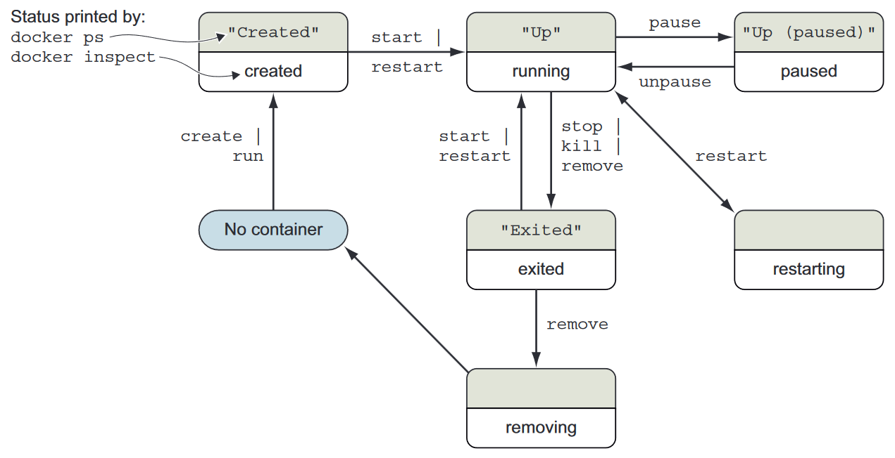

# Running software in containers

## Controlling containers: Building a website monitor

* In this section we'll build a solution of 3 containers
  * **_NGINX web server_** --> A container created from the nginx image, which depends on network port 80 **_as detached container_**
  * **_watcher_** --> A container created from the watcher image, which depends on the nginx container and the mailer container **_as interactive container_**
  * Running detached containers is a perfect fit for programs that sit quietly in the background. That type of program is called a **_daemon_**, or a **_service_**.
  * The containers need to be started in reverse order of their dependency chain
  * The link mechanism injects IP addresses into dependent containers, and containers that aren’t running don’t have IP addresses.

## Creating and starting a new container

* Run `docker run --detach --rm --name web nginx:latest` to download the `nginx:latest` image and create and run a container from it.
  * `--detach` or `-d` run as detached container
  * `--name web` or `-n` rename the container **_web_**.
  * Docker assigns a unique (human-friendly) name to each container it creates. The `--name` flag overrides that process with a known value
  * `nginx:latest` image name
  * `--rm` automatically remove the container as soon as it enters the exited state
  * `--read-only` so no changes can be applied to the enviroment
  * `-v` Mounts a writable directory from the host
* `docker container diff <container_name>` to check what has changed in it's files

```powershell
$ docker run --detach --name web nginx:latest
Unable to find image 'nginx:latest' locally
latest: Pulling from library/nginx
Status: Downloaded newer image for nginx:latest
e9ca720696557cbc5a450fe87cac4502975b7443859df86f265eb323084a7705 # new Unique ID for each container created
```

* Run ``docker run --interactive --tty --link web:web --name web_test busybox:1.29 /bin/sh`
  * `--interactive`, `-i` or `-it` option tells Docker to keep the standard input stream (stdin) open for the container even if no terminal is attached
  * `--tty` tells Docker to allocate a virtual terminal for the container, which will allow you to pass signals to the container.
  * if you're using `--tty` you can change from `interactive` state to `detach` state by `ctrl + p` then `q`
  * `create` can be used instead of `run` the primary difference being that the container is created in a stopped state
* Run `docker ps` will display the following information about each **_running_** container:
  * The container ID
  * The image used
  * The command executed in the container
  * The time since the container was created
  * The duration that the container has been running
  * The network ports exposed by the container
  * The name of the container
* Run `docker ps -a`  To see all thecontainers (including those in the created state)

```powershell
$ docker ps
CONTAINER ID   IMAGE          COMMAND                  CREATED          STATUS          PORTS     NAMES
e9ca72069655   nginx:latest   "/docker-entrypoint.…"   27 minutes ago   Up 27 minutes   80/tcp    web
```

* `docker restart <container_name>`
* `docker stop <container_name>`
* `docker logs <container_name>` and it's better to save the log data in a new `volume`
  * can be used with `--follow` or `-f` will display the logs and then continue watching and updating the display till you press `ctrl + C`
* Run `docker exec --interactive <container_name>` from inside another `container` shell and another process will be created in it
* some common conflict problems:
  * Two programs want to bind to the same network port.
  * Two programs use the same temporary filename, and file locks are preventing that.
  * Two programs want to use different versions of a globally installed library.
  * Two processes want to use the same PID file.
  * A second program you installed modified an environment variable that another program uses. Now the first program breaks.
  * Multiple processes are competing for memory or CPU time.
* `docker rename <new_container_name> <old_container_name>`
* `docker run  --detach --name my-database -e MYSQL_ROOT_PASSWORD=root mysql`
* `docker run -d --name web-app --link database:mysql -p 8000:80 --read-only -v /run/apache2/ wordpress:5.0.0-php7.2-apache`

## The state transition diagram for Docker containers



## Automatically restarting containers

* Using the `--restart` flag at container-creation time, you can tell Docker to do any of the following:
  * Never restart (default)
  * Attempt to restart when a failure is detected
  * Attempt for some predetermined time to restart when a failure is detected
  * Always restart the container regardless of the condition
* `docker top <container_name>` show the host PID for each of the processes in the container.
* The problem is that to kill a process inside a container from within that container,you need to know the PID in the container’s PID namespace. To get that list, run the following exec subcommand: `docker exec <container_name> ps` and to kill it `docker exec <container_name> kill <PID>`
* `docker rm <container_name>`
* If you try to remove a container that’s running, paused, or restarting, Docker will display a message like the following: `Error response from daemon: Conflict, You cannot remove a running container. Stop the container before attempting removal or use -f FATA[0000] Error: failed to remove one or more containers`
* problem can be solved by using either `docker stop <container_name>` first or `docker rm -vf <container_name>`
* `docker rm -vf <container_name>` or `docker kill <container_name>`  used only if you must stop the container in less than the standard 30-second maximum stop time.
* the `-vf` flag, Docker sends a `SIG_KILL` signal, which immediately terminates the receiving process.
* using `docker stop` will send a `SIG_HUP` signal. Recipients of `SIG_HUP` have time to perform finalization and cleanup tasks.
