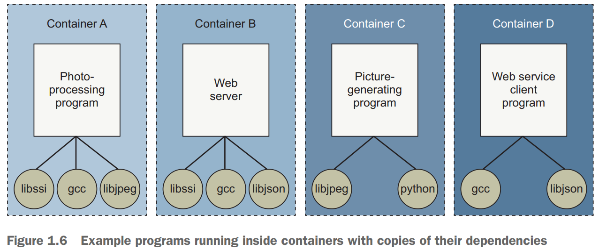

# Welcome To Docker

* `docker run <image_name>` tells Docker that you want to trigger the sequence (shown in figure 1.1) that installs and runs a program inside a container.

* the running state of a container is directly tied to the state of a single running program inside the container.
* If a program is running, the container is running. If the program is stopped, the container is stopped. Restarting a container will run the program again.
* The **_container_** goal has expanded from limiting filesystem scope to isolating a process from all resources except where explicitly allowed.

## Containers are not virtualization

* Virtual machines provide virtual hardware (or hardware on which an operating system and other programs can be installed).
* They take a long time (often minutes) to create and require significant resource overhead because they run a whole operating system in addition to the software you want to use.
* Virtual machines can perform optimally once everything is up and running, but the startup delays make them a poor fit for just-in-time or reactive deployment scenarios.
* Docker containers don’t use any hardware virtualization. Programs running inside Docker containers interface directly with the host’s Linux kernel.
* Many programs can run in isolation without running redundant operating systems or suffering the delay of full boot sequences.
* **_Docker is not a hardware virtualization technology. Instead, it helps you use the container technology already built into your operating system kernel_**

## Running software in containers for isolation

* Programs running inside a container can access only their own memory and resources as scoped by the container.

## Shipping containers

* You can think of a **_Docker_** container as a physical shipping container and **_Images_** are the shippable units in the **_Docker_** ecosystem
* It’s a box where you store and run an application and all of its dependencies (excluding the running operating system kernel).
* The component that fills the shipping container role is called an **_image_**.
* You can create as many containers from an image as you want. But when you do, containers that were started from the same image don’t share changes to their filesystem.
* When you distribute software with Docker, you distribute these images, and the receiving computers create containers from them.

## Getting organized

* At first it seems like this would introduce storage overhead by creating redundant copies of common dependencies such as gcc yet Docker packaging system typically reduces the storage overhead.

### Dependency relationships of example programs

### Example programs running inside containers with copies of their dependencies

## Getting help with the Docker command line

* Running `docker help` will display information about the basic syntax for using the docker command-line program.
* Running `docker help <command>` like `docker help cp` will display a usage pattern for `docker cp`, a general description of what the command does, and a detailed breakdown of its arguments.
