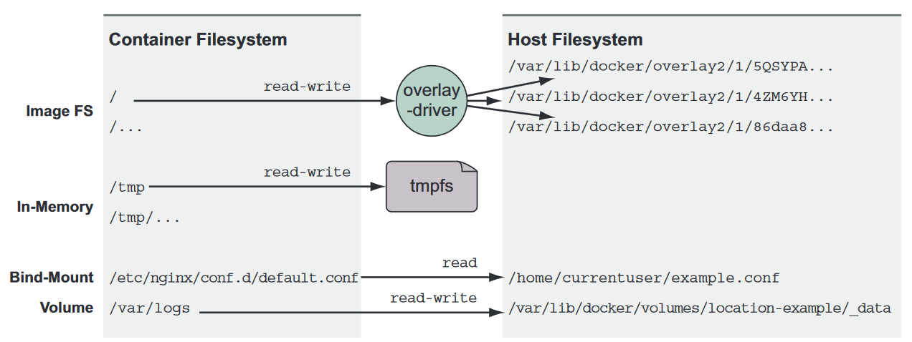

# Working with storage and volumes

## Example of common container storage mounts

* All three types of mount points can be created using the `--mount` flag on the `docker run` and `docker create`
  subcommands
* bind mounts attach a **_user-specified location_** on the **_host filesystem_** to a specific point in a **_container
  file tree_**

## In-memory storage

* private key files, database passwords, API key files, or other sensitive configuration files, and need upload
  buffering space.
* `docker run --rm --mount type=tmpfs,dst=/tmp --entrypoint mount <image_name:version>`

## Docker volumes

* volume is a tool for segmenting and sharing data that has a scope or life cycle that’s independent of a single
  container
* `docker volume create --driver local <volume_name>`
* `docker volume inspect <volume_name>`
* `docker run -d --volume <volume_name>:/var/lib/<target_directory> --name <container_name>`
* images are appropriate for packaging and distributing relatively static files such as programs; volumes hold dynamic
  data or specializations.
* The major drawback to this approach is that all containers involved must agree on the exact location on the host file
  path, and they may conflict with other containers that also intend to read or manipulate files at that location.
* `docker run --rm <volume_name>`  or `docker rm -v <volume_name>`
* no volume that is currently in use can be deleted. More specifically, no volume attached to any container in any state
  can be deleted. 